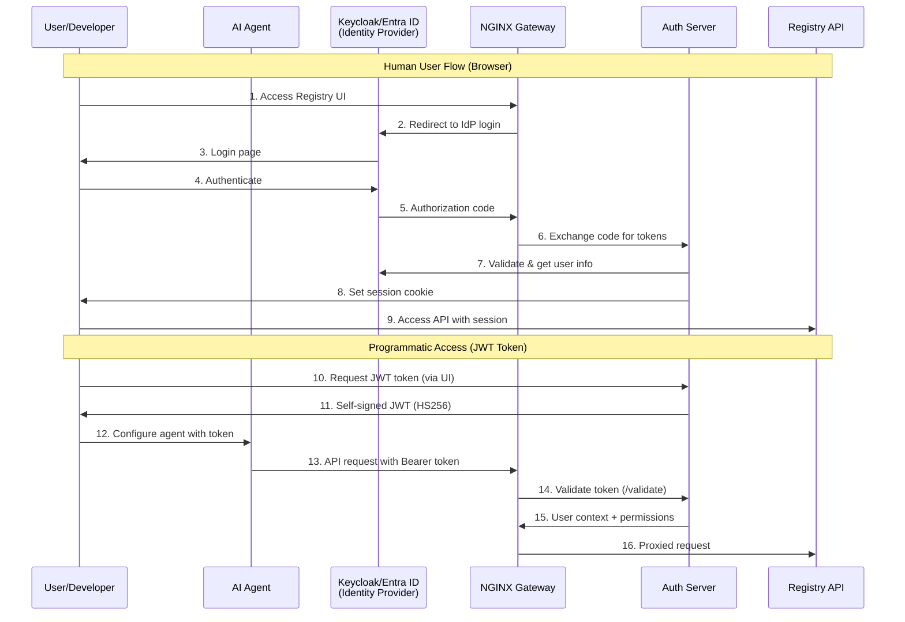
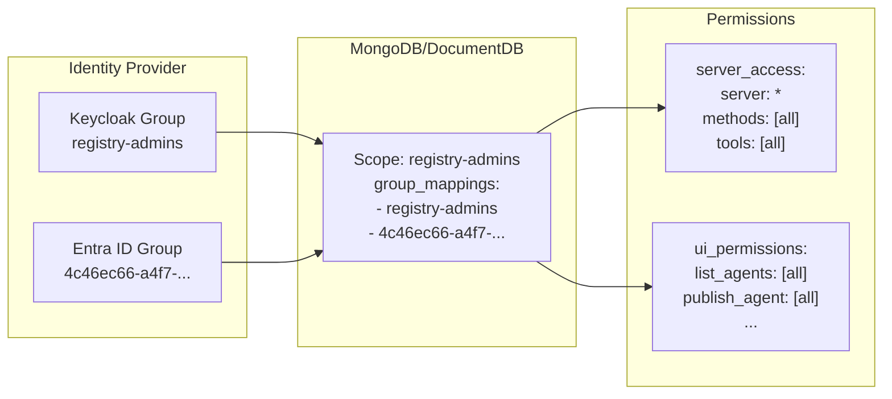
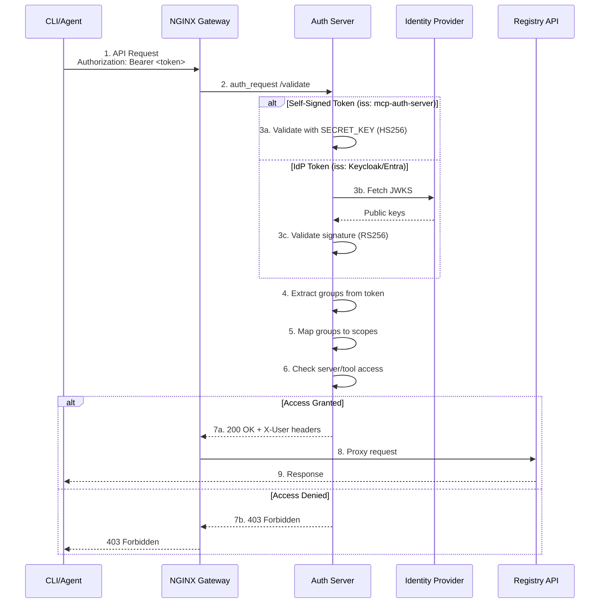

# Authentication and Authorization

The MCP Gateway Registry provides authentication and authorization using industry-standard OAuth 2.0 flows with fine-grained access control.

## Overview

The authentication system supports three distinct identity scenarios:

1. **Human Users** - Interactive users accessing the Registry UI via browser
2. **Programmatic Access** - Self-signed JWT tokens for CLI tools and AI coding assistants
3. **Workload Identity (M2M)** - Service accounts for AI agents and automated systems

## Related Documentation

### Design Documents

For architectural details and design decisions:

- [Authentication Design](design/authentication-design.md) - Detailed auth flows for human users, programmatic access, and M2M workloads
- [Multi-Provider IdP Support](design/idp-provider-support.md) - Architecture for supporting multiple identity providers (Keycloak, Entra ID)

### Configuration Guides

For setup and configuration:

- [Scopes Management](scopes-mgmt.md) - Scope configuration file format and fine-grained access control
- [Authentication Management](auth-mgmt.md) - Managing users, groups, and scopes via CLI
- [Microsoft Entra ID Setup](entra-id-setup.md) - Entra ID-specific setup and configuration
- [Complete Setup Guide](complete-setup-guide.md) - End-to-end deployment instructions

---

## Authentication Architecture

### Identity Types

The system distinguishes between three types of identities, each with different authentication flows:

| Identity Type | Use Case | Auth Method | Token Signing | Lifetime |
|--------------|----------|-------------|---------------|----------|
| Human Users | Browser UI | OAuth2 Authorization Code | RS256 (IdP) | Session-based |
| Programmatic | CLI, AI assistants | Self-signed JWT | HS256 (SECRET_KEY) | 8 hours |
| M2M Workloads | AI agents, automation | OAuth2 Client Credentials | RS256 (IdP) | 1 hour |

### Supported Identity Providers

The registry supports multiple identity providers through a pluggable architecture:

- **Keycloak** - Open-source identity management
- **Microsoft Entra ID** - Enterprise Azure AD integration

Provider selection is controlled by the `AUTH_PROVIDER` environment variable:

```bash
AUTH_PROVIDER=keycloak   # Use Keycloak (default)
AUTH_PROVIDER=entra      # Use Microsoft Entra ID
```

---

## High-Level Authentication Flow



---

## Authorization Model

### Scope-Based Access Control

Authorization is based on **scopes** that define:

1. **Server Access** - Which MCP servers and methods users can access
2. **Agent Actions** - Which agent operations users can perform
3. **UI Permissions** - Which UI features are available

### Group-to-Scope Mapping

User permissions are determined by mapping IdP groups to scopes stored in MongoDB/DocumentDB:



### Scope Configuration

Scopes are defined in JSON files and loaded into MongoDB. See [Scopes Management](scopes-mgmt.md) for the complete file format.

**Example: Admin Scope**

```json
{
  "_id": "registry-admins",
  "group_mappings": ["registry-admins", "4c46ec66-a4f7-4b62-9095-b7958662f4b6"],
  "server_access": [
    {"server": "*", "methods": ["all"], "tools": ["all"]}
  ],
  "ui_permissions": {
    "list_agents": ["all"],
    "publish_agent": ["all"],
    "list_service": ["all"],
    "toggle_service": ["all"]
  }
}
```

**Example: Limited User Scope**

```json
{
  "_id": "public-mcp-users",
  "group_mappings": ["public-mcp-users", "5f605d68-06bc-4208-b992-bb378eee12c5"],
  "server_access": [
    {"server": "context7", "methods": ["initialize", "tools/list", "tools/call"], "tools": ["*"]}
  ],
  "ui_permissions": {
    "list_service": ["all"],
    "list_agents": ["/flight-booking"],
    "get_agent": ["/flight-booking"]
  }
}
```

---

## Token Validation Flow

All API requests are validated by the auth server through NGINX's `auth_request` directive:



---

## Key Security Layers

### Layer 1: Gateway Authentication

The NGINX gateway validates all incoming requests:

- Extracts JWT from `Authorization` header
- Calls auth server `/validate` endpoint
- Sets user context headers for downstream services

### Layer 2: Token Validation

The auth server supports multiple token types:

| Token Type | Issuer | Algorithm | Validation Method |
|------------|--------|-----------|-------------------|
| Self-signed | `mcp-auth-server` | HS256 | SECRET_KEY |
| Keycloak | `{keycloak_url}/realms/{realm}` | RS256 | JWKS endpoint |
| Entra ID | `https://sts.windows.net/{tenant}/` | RS256 | JWKS endpoint |

### Layer 3: Scope-Based Authorization

After token validation, the auth server:

1. Extracts `groups` claim from token
2. Queries MongoDB for matching scopes (via `group_mappings`)
3. Validates requested server/method/tool against `server_access` rules
4. Returns user context with permissions

---

## Permission Types

### MCP Server Permissions

Control access to MCP servers and their tools:

| Permission | Description |
|------------|-------------|
| `server` | Server name or `*` for all |
| `methods` | Allowed MCP methods (initialize, tools/list, tools/call, etc.) |
| `tools` | Allowed tool names or `*` for all |

### Agent Permissions

Control operations on A2A agents:

| Permission | Description |
|------------|-------------|
| `list_agents` | View agents in listings |
| `get_agent` | View agent details |
| `publish_agent` | Register new agents |
| `modify_agent` | Update existing agents |
| `delete_agent` | Remove agents |

### UI Permissions

Control access to UI features:

| Permission | Description |
|------------|-------------|
| `list_service` | View MCP servers in dashboard |
| `register_service` | Register new MCP servers |
| `health_check_service` | Run health checks |
| `toggle_service` | Enable/disable servers |
| `modify_service` | Edit server configurations |

---

## Entra ID Group Mapping

When using Microsoft Entra ID, group identifiers are Object IDs (GUIDs), not names:

```json
{
  "group_mappings": [
    "public-mcp-users",
    "5f605d68-06bc-4208-b992-bb378eee12c5"
  ]
}
```

This allows the same scope to work with both Keycloak (group names) and Entra ID (Object IDs).

**Finding Entra ID Group Object IDs:**

1. Azure Portal > Azure Active Directory > Groups
2. Select the group
3. Copy the "Object ID" from the Overview page

---

## Session Management

### Human User Sessions

Browser sessions use signed cookies:

- Created after successful OAuth2 login
- Contains: username, groups, provider, scopes
- Validated using `SECRET_KEY` (HS256)
- Default expiry: 8 hours (configurable)

### Programmatic Tokens

Self-signed JWT tokens for CLI/API access:

- Generated via "Get JWT Token" in UI
- Contains: username, groups, scopes, permissions
- Signed with `SECRET_KEY` (HS256)
- Default expiry: 8 hours

### M2M Tokens

Service account tokens from IdP:

- Obtained via OAuth2 Client Credentials flow
- Signed by IdP (RS256)
- Default expiry: 1 hour
- Must be refreshed periodically

---

## Security Best Practices

1. **Use HTTPS** - All production deployments should use TLS
2. **Rotate Secrets** - Regularly rotate SECRET_KEY and client secrets
3. **Least Privilege** - Assign minimal required permissions to users/agents
4. **Audit Logging** - Monitor authentication events and access patterns
5. **Token Expiry** - Use short-lived tokens and implement refresh flows

---

## Troubleshooting

### Common Issues

**Token validation fails:**
- Check token issuer matches expected provider
- Verify JWKS endpoint is accessible
- Ensure SECRET_KEY matches between auth server instances

**Permission denied:**
- Verify user's groups in IdP
- Check group_mappings in scope configuration
- Ensure scope includes required server/method access

**Group not recognized:**
- For Entra ID: Use Object ID, not group name
- Verify group exists in group_mappings array
- Reload scopes after configuration changes

### Debug Endpoints

```bash
# Check user context
curl -H "Authorization: Bearer $TOKEN" \
  https://registry.example.com/api/debug/user-context

# List available scopes
curl -H "Authorization: Bearer $TOKEN" \
  https://registry.example.com/api/scopes
```

---

## Server Authentication Credentials

The MCP Gateway Registry supports backend server authentication, allowing MCP servers that require their own authentication (API keys, bearer tokens, etc.) to be registered with encrypted credentials.

### Overview

When an MCP server requires authentication, you can provide the credentials during registration. The registry:

1. **Encrypts** the credential using Fernet symmetric encryption
2. **Stores** the encrypted credential in MongoDB/DocumentDB
3. **Automatically decrypts** and uses the credential for:
   - Health checks
   - Tool discovery and fetching
   - MCP client connections

### Supported Authentication Schemes

| Scheme | Description | Example Use Case |
|--------|-------------|------------------|
| `none` | No authentication required | Public MCP servers |
| `bearer` | Bearer token in `Authorization` header | OAuth2-protected services |
| `api_key` | API key with custom header name | Services requiring API keys (e.g., `X-API-Key`, `CONTEXT7_API_KEY`) |

### Credential Encryption

All credentials are encrypted before storage using the Fernet encryption scheme:

- **Algorithm**: Fernet (symmetric encryption based on AES-128-CBC)
- **Key**: Derived from `ENCRYPTION_KEY` environment variable
- **Storage**: Encrypted credential stored as `auth_credential_encrypted` in MongoDB
- **Decryption**: Automatic during health checks and MCP client initialization

**Configuration** (`.env` file):
```bash
# Encryption key for server credentials (base64-encoded Fernet key)
ENCRYPTION_KEY=your-base64-encoded-fernet-key-here

# Generate a new key with: python -c "from cryptography.fernet import Fernet; print(Fernet.generate_key().decode())"
```

### Registering Servers with Authentication

#### Method 1: Registry UI

1. Navigate to **Register Server** in the Registry UI
2. Fill in server details (name, path, proxy URL, etc.)
3. Select **Authentication Scheme**:
   - `none` - No authentication
   - `bearer` - Bearer token
   - `api_key` - API key
4. If `bearer` or `api_key`:
   - Enter the **credential** (API key or bearer token)
   - For `api_key`: Specify the **header name** (e.g., `CONTEXT7_API_KEY`, `X-API-Key`)
5. Click **Register**


The credential is automatically encrypted and stored securely.

#### Method 2: REST API

**Register server with bearer token:**

```bash
curl -X POST https://registry.example.com/api/servers/register \
  -H "Authorization: Bearer $TOKEN" \
  -F "server_name=My Protected Server" \
  -F "path=/my-server" \
  -F "proxy_pass_url=http://backend:8000/" \
  -F "auth_scheme=bearer" \
  -F "auth_credential=my-bearer-token-value" \
  -F "description=A server requiring bearer auth"
```

**Register server with API key:**

```bash
curl -X POST https://registry.example.com/api/servers/register \
  -H "Authorization: Bearer $TOKEN" \
  -F "server_name=Context7" \
  -F "path=/context7" \
  -F "proxy_pass_url=http://context7:8000/" \
  -F "auth_scheme=api_key" \
  -F "auth_credential=ctx7sk-6dd75bd4-80ef-486e-99ef-b5493df4e578" \
  -F "auth_header_name=CONTEXT7_API_KEY" \
  -F "description=Context7 LLM context service"
```

**Response:**
```json
{
  "message": "Server registered successfully",
  "path": "/context7",
  "server_name": "Context7",
  "auth_scheme": "api_key",
  "auth_header_name": "CONTEXT7_API_KEY",
  "auth_credential_encrypted": true
}
```

#### Method 3: CLI Tool (`registry_management.py`)

**Register server with credentials:**

```bash
# Set up authentication
export REGISTRY_URL=https://registry.example.com
export REGISTRY_TOKEN=$(cat .token)

# Register with API key
python3 api/registry_management.py \
  --registry-url $REGISTRY_URL \
  --token $REGISTRY_TOKEN \
  server-register \
  --name "Context7" \
  --path "/context7" \
  --proxy-pass-url "http://context7:8000/" \
  --auth-scheme api_key \
  --auth-credential "ctx7sk-6dd75bd4-80ef-486e-99ef-b5493df4e578" \
  --auth-header-name "CONTEXT7_API_KEY" \
  --description "Context7 LLM context service"

# Register with bearer token
python3 api/registry_management.py \
  --registry-url $REGISTRY_URL \
  --token $REGISTRY_TOKEN \
  server-register \
  --name "Cloudflare API" \
  --path "/cloudflare-api" \
  --proxy-pass-url "http://cloudflare-mcp:8000/" \
  --auth-scheme bearer \
  --auth-credential "my-cloudflare-bearer-token" \
  --description "Cloudflare MCP Server"
```

### Updating Server Credentials

Credentials can be updated without re-registering the entire server.

#### Method 1: REST API

**Update credential endpoint:**

```bash
curl -X PUT https://registry.example.com/api/servers/context7/credentials \
  -H "Authorization: Bearer $TOKEN" \
  -H "Content-Type: application/json" \
  -d '{
    "auth_scheme": "api_key",
    "auth_credential": "new-api-key-value",
    "auth_header_name": "CONTEXT7_API_KEY"
  }'
```

**Switch to bearer token:**

```bash
curl -X PUT https://registry.example.com/api/servers/my-server/credentials \
  -H "Authorization: Bearer $TOKEN" \
  -H "Content-Type: application/json" \
  -d '{
    "auth_scheme": "bearer",
    "auth_credential": "new-bearer-token"
  }'
```

**Remove authentication:**

```bash
curl -X PUT https://registry.example.com/api/servers/my-server/credentials \
  -H "Authorization: Bearer $TOKEN" \
  -H "Content-Type: application/json" \
  -d '{
    "auth_scheme": "none"
  }'
```

**Response:**
```json
{
  "message": "Auth credentials updated successfully",
  "path": "/context7",
  "auth_scheme": "api_key",
  "auth_header_name": "CONTEXT7_API_KEY"
}
```

#### Method 2: CLI Tool

**Update server credential:**

```bash
python3 api/registry_management.py \
  --registry-url $REGISTRY_URL \
  --token $REGISTRY_TOKEN \
  server-update-credential \
  --path "/context7" \
  --auth-scheme api_key \
  --credential "new-api-key-value" \
  --auth-header-name "CONTEXT7_API_KEY"
```

**Update to bearer token:**

```bash
python3 api/registry_management.py \
  --registry-url $REGISTRY_URL \
  --token $REGISTRY_TOKEN \
  server-update-credential \
  --path "/cloudflare-api" \
  --auth-scheme bearer \
  --credential "new-bearer-token-value"
```

**Remove authentication:**

```bash
python3 api/registry_management.py \
  --registry-url $REGISTRY_URL \
  --token $REGISTRY_TOKEN \
  server-update-credential \
  --path "/my-server" \
  --auth-scheme none
```

**Output:**
```
Successfully updated credentials for server '/context7'
New auth scheme: api_key
Auth header name: CONTEXT7_API_KEY
```

### How Credentials Are Used

#### 1. Health Checks

When the health check service performs periodic checks, it:

1. Retrieves the server's `auth_credential_encrypted` from MongoDB
2. Decrypts the credential using the `ENCRYPTION_KEY`
3. Includes the appropriate header in the MCP initialize request:
   - Bearer: `Authorization: Bearer <decrypted_token>`
   - API Key: `<auth_header_name>: <decrypted_key>`

**Example health check with auth:**

```python
# Health check service automatically decrypts and uses credentials
headers = {}
if server.auth_scheme == "bearer":
    headers["Authorization"] = f"Bearer {decrypt_credential(server.auth_credential_encrypted)}"
elif server.auth_scheme == "api_key":
    header_name = server.auth_header_name or "X-API-Key"
    headers[header_name] = decrypt_credential(server.auth_credential_encrypted)

# MCP initialize request with auth headers
response = await mcp_client.initialize(url=server.proxy_pass_url, headers=headers)
```

#### 2. Tool Discovery

When fetching tools from a server:

1. Registry decrypts the credential
2. Includes auth headers in the MCP `tools/list` request
3. Stores the fetched tools in the database

#### 3. MCP Client Connections

When AI coding assistants connect to a server through the gateway:

1. User provides gateway auth token (`X-Authorization` header)
2. Gateway validates user permissions
3. Gateway retrieves and decrypts server credential
4. Gateway proxies the request with the server's auth header

**Example MCP client configuration:**

```json
{
  "mcpServers": {
    "context7": {
      "type": "streamable-http",
      "url": "https://mcpgateway.ddns.net/context7/mcp",
      "disabled": false,
      "headers": {
        "X-Authorization": "Bearer <user_gateway_token>",
        "CONTEXT7_API_KEY": "<server_api_key>"
      }
    }
  }
}
```

### Security Considerations

1. **Encryption at Rest**:
   - All credentials are encrypted in MongoDB using Fernet
   - Never store plaintext credentials in the database

2. **Key Management**:
   - Store `ENCRYPTION_KEY` securely (AWS Secrets Manager, Vault, etc.)
   - Never commit encryption keys to version control
   - Rotate encryption keys periodically

3. **Access Control**:
   - Only users with `register_service` or `modify_service` permissions can set/update credentials
   - Credentials are never returned in API responses (only `auth_credential_encrypted` flag)

4. **Audit Logging**:
   - All credential updates are logged with username and timestamp
   - Review audit logs regularly for unauthorized changes

### Best Practices

1. **Use Environment-Specific Credentials**:
   - Development: Use test credentials with limited access
   - Production: Use production credentials with full access

2. **Rotate Credentials Regularly**:
   - Use the credential update API/CLI to rotate without downtime
   - Update credentials before they expire

3. **Monitor Health Checks**:
   - Watch for "auth-expired" health status
   - Set up alerts for authentication failures

4. **Document Custom Headers**:
   - For `api_key` auth, document the required header name
   - Ensure consistency across environments

### Troubleshooting

**Credential Update Fails:**
```bash
# Verify server exists
curl -H "Authorization: Bearer $TOKEN" \
  https://registry.example.com/api/servers

# Check auth scheme is valid
# Valid values: none, bearer, api_key
```

**Health Check Shows "auth-expired":**
```bash
# Update the credential
python3 api/registry_management.py \
  server-update-credential \
  --path "/my-server" \
  --auth-scheme bearer \
  --credential "new-valid-token"

# Force immediate health check
curl -X POST -H "Authorization: Bearer $TOKEN" \
  https://registry.example.com/api/servers/my-server/refresh
```

**MCP Client Connection Fails:**
- Verify both gateway auth (`X-Authorization`) and server auth headers are present
- Check credential hasn't expired
- Ensure `auth_header_name` matches server's expectation

---

## Additional Resources

- [Authentication Design](design/authentication-design.md) - Detailed auth flow diagrams
- [IdP Provider Support](design/idp-provider-support.md) - Provider architecture
- [Scopes Management](scopes-mgmt.md) - Scope file format reference
- [Auth Management](auth-mgmt.md) - CLI operations guide
- [AI Coding Assistants Setup](ai-coding-assistants-setup.md) - Complete setup with backend auth examples
